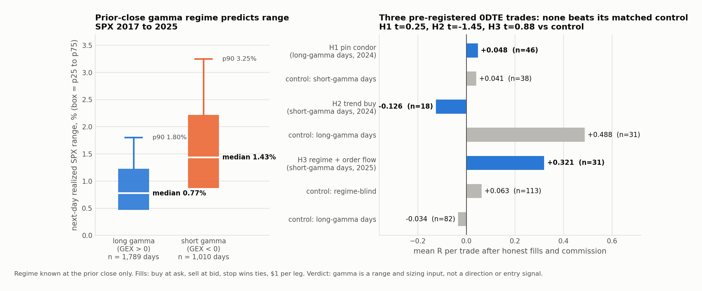

# Dealer gamma: it predicts the day's range, not its direction, and not a 0DTE entry

**Question.** Dealer gamma positioning at the prior close is widely claimed to set the day's character: long gamma pins, short gamma trends. Is that true, and can it be traded with 0DTE SPX options?

**Data.** Daily net dealer-gamma levels for SPX built from end-of-day option greeks and open interest (ThetaData, 2017 to 2026). One-minute SPXW option panels (2024, 2025 from May, 2026). ES one-minute bars as the intraday SPX proxy, anchored to the prior close so the path carries no lookahead. ES MBP-1 for the order-flow trigger (2025-05 onward). 2026 was sealed as the holdout and never opened.

## Part 1: the regime is real, for range

Prior-day gamma sign against the next day's realized SPX range, 2017 to 2025:

| prior-day regime | days | median range | p25 | p75 | p90 |
|---|---|---|---|---|---|
| long gamma (GEX > 0) | 1,789 | 0.77% | 0.47% | 1.22% | 1.80% |
| short gamma (GEX < 0) | 1,010 | 1.43% | 0.87% | 2.22% | 3.25% |

Cross-index check at an intraday decision time (10:00 ET, rest-of-day range, 2025 to 2026): short-gamma days run 1.3× to 1.7× the range of long-gamma days on SPX, NDX and RUT, strongest where the 0DTE market is deepest. The effect survives the "is it just realized vol" check: partial correlation with range after controlling for the morning's range is −0.15 on NDX and −0.31 on SPX. The trend-versus-chop ratio is the same in both regimes, so gamma says nothing about direction.

## Part 2: three pre-registered 0DTE trades, all rejected

Each leg had its entry, exit, matched control and kill criteria written before it ran (`PROGRAM.md`). Fills are honest: buy at ask, sell at bid, stop wins ties, commission per leg. The regime is known only at the prior close. A leg passed only if mean R > 0, t > 2 against zero, t > 2 against its matched control, and the edge was not confined to one quarter.

| leg | trade | n | mean R | matched control | t vs control | verdict |
|---|---|---|---|---|---|---|
| H1 pin | sell a 15-delta iron condor at 10:30 ET on long-gamma days, 25-point wings, hold to settlement or buy back on a short-strike touch | 46 | +0.048 | same condor on short-gamma days: +0.041 | 0.25 | fail: the condor earns decay, the regime adds nothing |
| H2 trend | buy a 30-delta option on the first intraday cross of the gamma flip on short-gamma days, target the same-side wall | 18 | −0.126 | same trade on long-gamma days: +0.488 | −1.45 | fail: worse on trend days, the thesis inverts |
| H3 stack | short-gamma regime as filter, ES order-flow burst as trigger, 30-delta option as expression (2025) | 31 | +0.321 | regime-blind: +0.063; long-gamma days: −0.034 | 0.88 / 1.21 | fail: t = 1.18 against zero, quarters −0.32 / +0.30 / +0.61 |

Two frozen-definition bugs were caught and fixed before any verdict, and neither touched a kill criterion. The zero-gamma level in the daily walls file sits about 15% below spot and never fires intraday, so the flip was recomputed per minute from per-strike gamma × prior open interest. A flip-recross stop that sat at the entry level and strangled the trade was removed.

The order-flow trigger was checked on its own: burst direction predicted the next 30 minutes 44.5% of the time (n = 110), mildly contrarian. That matches the rest of the lab's order-flow record.

**Conclusion.** Gamma regime is a genuine range and sizing input, and it is shipped as context. It is not a directional signal and not a 0DTE entry signal in these forms. The 2026 holdout stays sealed because nothing earned the one read.

## Files

- `PROGRAM.md`: the pre-registration. Thesis, frozen entries and exits, matched controls, kill criteria, laws, data status, and the dated status log.
- `results/`: per-trade tables for each leg and control (CSV), the range reference by regime, the H3 run log, and the verdicts recomputed from the saved tables.
- `selected_code/regime.py`: prior-close regime labeller (strictly T−1, no same-day rows).
- `selected_code/underlying.py`: ES-to-SPX intraday proxy through a prior-close basis.
- `selected_code/panel_io.py`: 0DTE panel reader, Black-Scholes delta strike selection, honest fills.
- `selected_code/gamma_flip.py`: intraday net-gamma flip from per-strike gamma × prior OI.
- `selected_code/h1_pin.py`, `h2_trend.py`, `h3_stack.py`: the three legs, each with its control switch.
- `selected_code/orderflow.py`: the MBP-1 net-delta burst trigger.
- `selected_code/run.py`, `run_stack.py`: the runners that print the pre-registered verdicts.

The option panels, gamma levels, and futures data are not included.
