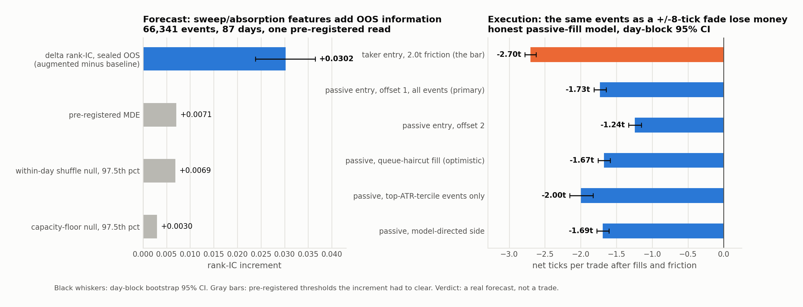

# NQ order flow: sweep/absorption features vs. an order-flow baseline

**Question.** After an aggressive sweep in NQ, do sweep and absorption features predict whether price continues or reverses, *beyond* what ordinary order-flow imbalance and depth already say?

**Data.** NQ front-month MBP-1 (top of book plus every trade, Databento), regular session only. Design window 2025-05-01 to 2026-01-31 (183 days). Out-of-sample window 2026-02-01 to 2026-06-09, sealed until a single read.

## Design

- **Event.** A maximal run of same-side aggressor trades (gap ≤ 2 s) that displaces price ≥ 8 ticks on ≥ 20 contracts. About 418 per day. The cell was chosen by frequency, not by any return bucket.
- **Decision time.** The last trade record of the run, indexed by (timestamp, sequence) rather than timestamp alone, so a same-timestamp print that arrives after the decision stays on the far side of it.
- **Target.** First touch of ±8 ticks from the sweep extreme, resolved on the trade sequence, 15-minute cap. Ties count as reversal. Unresolved and window-miss events are dropped with the same mask for both models.
- **Baseline model.** LightGBM on signed volume over 1 s / 5 s / 30 s, top-of-book imbalance, total depth, spread, time of day. Deliberately strong and resolution-matched, so the increment cannot come from finer OFI the baseline was denied.
- **Augmented model.** Baseline plus ticks swept, sweep speed, volume per tick (absorption proxy), a fresh-extreme flag, and the change in opposite-side resting depth over the run. Two candidate features were dropped before the lock for collinearity with the baseline.
- **Statistic.** Δ rank-IC = rankIC(augmented) − rankIC(baseline), from a paired day-block bootstrap (2,000 draws), so within-day clustering is respected. Both models are a deterministic 10-seed ensemble with frozen hyperparameters, fit on the design window and scored once on the sealed window.
- **Nulls.** A capacity-floor null (refit with the sweep features permuted, 500 draws) and a within-day label shuffle (1,000 draws). Δ had to clear the 97.5th percentile of both, the pre-registered minimum detectable effect, and be non-negative in both chronological halves.
- **Pre-registration.** The protocol was frozen before the read and the parameter file hashed (the full protocol document is available on request). The read script verifies that hash, refuses to run without an explicit lock flag, and emits a fixed list of outputs. Per-feature ablation is forbidden on the sealed window because it would leak which feature worked. `test_leakage.py` proves by construction that features read only records at or before the decision and the target reads only records after it.

## Result: one read of the sealed window

| | |
|---|---|
| events / days | 66,341 / 87 |
| baseline rank-IC | +0.1345 |
| augmented rank-IC | +0.1647 |
| **Δ rank-IC** | **+0.0302**, day-block 95% CI [+0.0238, +0.0365] |
| pre-registered MDE | 0.0071 |
| capacity-floor null, 97.5th pct | +0.0030 |
| within-day shuffle null, 97.5th pct | +0.0069 |
| chronological halves | +0.0290 / +0.0311 |

The out-of-fold estimate on the design window before the lock was +0.0238. The sealed result held rather than decayed. Verdict as registered: the sweep/absorption block adds real out-of-sample information, about 4× the MDE and 10× the capacity floor.

## Then the execution test, which it failed

Fading the sweep with a symmetric ±8-tick target on the same event class (development window, 81,020 events over 183 days):

- **Taker entry, 2.0 ticks friction: −2.70 ticks per trade** (CI [−2.78, −2.62]).
- **Passive limit entry: −1.73 ticks per trade** (CI [−1.81, −1.65]), fill rate 64.8%. The fill model is built to make a fake edge harder: a fill requires a trade *through* the limit, the adverse barrier is checked before the fill on every tick, and a missed fill falls back to the taker trade rather than being dropped.
- Passive entry is worth about +1 tick and that gain is real, not eaten by adverse selection. But the fade fills on 46% of its winners and 98% of its losers. The good reversals never come back to a resting order.
- Selecting bigger-range events made it worse. A shuffled selection did the same, so the selection carried nothing.

**Conclusion.** A real forecast, not a trade. The move is too small relative to friction. Recorded and moved on.

## Files

- `OOS_VERDICT.md`: the one sealed read, verbatim.
- `COST_TEST_V2.md`: the execution test with the honest fill model.
- `selected_code/design_diagnostics.py`: event detection, feature construction (reads ≤ decision), target resolution (reads > decision), pre-lock diagnostics.
- `selected_code/oos_read.py`: the locked read. Hash check, ensemble, paired bootstrap, nulls, output firewall.
- `selected_code/cost_test_v2.py`: passive-fill model and cost test.
- `selected_code/test_leakage.py`: structural no-lookahead tests.

Data readers and the warehouse are not included.
