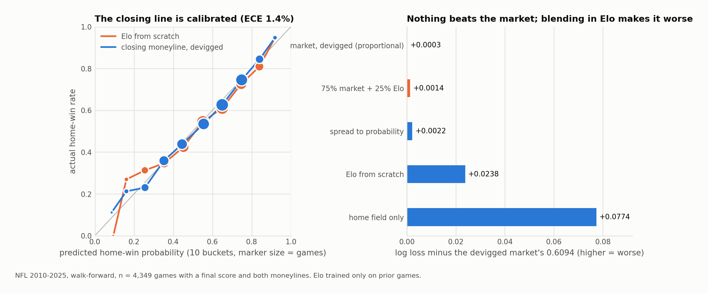

# Prediction markets: the NFL closing line and Kalshi sports markets

**Premise.** The job is not to predict sports. It is to find where the market's price is wrong. Those are different problems and only the second one pays. So every experiment here starts by measuring the market, then asks whether anything beats it.

## 1. The NFL closing line is the bar

Walk-forward over 2010 to 2025: 4,349 games with a final score and both moneylines. Every prediction uses only prior seasons. Elo ratings, the spread-to-probability sigma, and the home-field rate are all refit on the past.

| model | log loss | Brier | accuracy | ECE | vs. market |
|---|---|---|---|---|---|
| market, devigged (power) | 0.6094 | 0.2111 | 66.4% | 1.4% | baseline |
| market, devigged (proportional) | 0.6096 | 0.2111 | 66.4% | 1.6% | +0.0003 |
| 75% market + 25% Elo | 0.6108 | 0.2116 | 66.3% | 1.6% | +0.0014 |
| spread to probability | 0.6116 | 0.2118 | 66.4% | 3.2% | +0.0022 |
| Elo from scratch | 0.6332 | 0.2215 | 64.5% | 2.6% | +0.0238 |
| home field only | 0.6868 | 0.2468 | 55.7% | 0.8% | +0.0774 |

Blending a competent Elo into the market price makes the forecast worse, not better. The market already contains what Elo knows, and mixing in a noisier estimate degrades it. Calibration error across the probability buckets is 1.4% and the largest bucket deviation is z = −1.44. Nothing is significant. Every blind strategy (all home teams, home dogs, big dogs, divisional dogs) loses about the vig.

So the strategy does not compete with the market price. It starts from it.



Reproduce it:

```bash
pip install -r requirements.txt
python experiments/exp01_market_baseline.py
```

The input (nflverse `games.csv`, snapshot of 2026-07-30) is included so the numbers above are exactly reproducible. The loader will fetch a current copy if the file is missing.

## 2. Kalshi

Public read API, no credentials. Roughly 60,000 open sports markets at any moment, of which only about 58 carry a two-sided quote.

- **Ladder arbitrage: dead in ten minutes.** Strikeout ladders quote P(K ≥ k) at every strike at once, so a quote violating P(X ≥ k) ≥ P(X ≥ k+1) would be riskless. The monotonicity screen in `sportmodels/kalshi.py` found zero violations. One idea killed, correctly.
- **The exchange's own pregame price is well calibrated.** Scoring the last executable mid before first pitch, never the settled price: on 11,288 strikeout markets, log loss 0.478 against a 0.687 base rate, ECE 0.8%. Skill varies by series (`results/exp06_survey.csv`).
- **Adverse selection on resting orders.** Every print names the taker side, so maker P&L is measurable from public data. On strikeout props, makers earned +0.0048 per contract, t = +1.62. Replicated across four maker-free prop series (all four positive gross) with a built-in control: the game-level series, where makers pay fees, reads flat gross and negative net (`results/exp09_replication.csv`). Suggestive rather than conclusive. The control differs from the props in liquidity as well as fees, and the write-up says so.

## 3. NFL player props

No Kalshi prop history existed yet, so the testable question was whether the game's spread and total carry information about player volume beyond a player's recent form. Distribution forecasts at realistic thresholds, walk-forward.

- Market context helps passing props (log loss −0.012) and adds almost nothing to rushing and receiving (`results/exp11_prop_board.csv`). Predicted in advance: a quarterback owns all of his team's attempts, a back shares carries.
- Role (share of team volume, and the share vacated by ruled-out teammates) helps carries (−0.008) and not passing, the mirror image of the market block (`results/exp12_role.csv`).
- The 90-minute inactives report is worth roughly nothing over the Friday injury designation once role is modeled (`results/exp14_inactives.csv`). A specific clock to trade against turned out not to be one.

## Files

- `sportmodels/market.py`: American odds, devig (proportional and power), spread to probability, EV, Kelly.
- `sportmodels/evaluate.py`: log loss, Brier, calibration table, ECE, season walk-forward splits.
- `sportmodels/kalshi.py`: read-only client, quadratic fee model, ladder monotonicity screen, implied survival function.
- `sportmodels/nfl_data.py`: nflverse loaders with local caching.
- `experiments/exp01_market_baseline.py`: runnable, produces the table above.
- `experiments/exp09_maker_replication.py`: the maker replication with its control. Needs Kalshi trade tapes, not included.
- `results/`: outputs of the experiments cited above.
