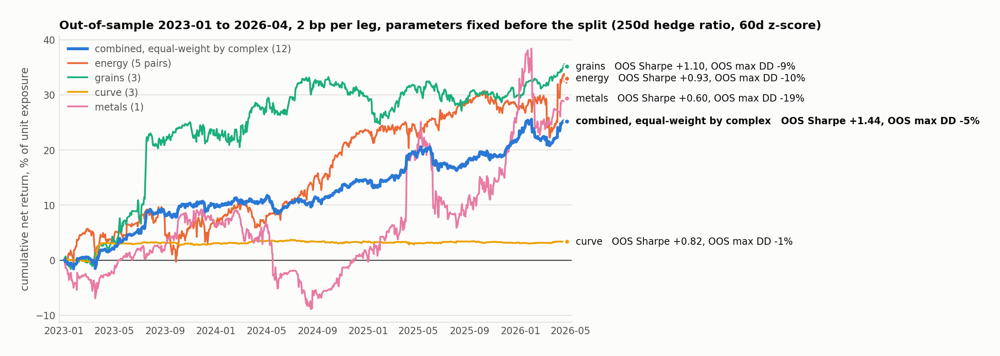

# Relative-value futures: from a pairs scan to a 12-pair cointegrated book

**Question.** Is there a systematic relative-value edge in CME futures that survives out of sample, or is it just the few obvious pairs?

**Data.** Daily returns for 26 continuous front-month CME futures (equity indices, rates, energy, metals, grains, FX), 2018-05 to 2026-04, built from a 1-minute parquet warehouse. In-sample before 2023-01-01, out-of-sample after. The panel is derived from licensed Databento data and is not included.

**Method, identical in every script.** Log price is rebuilt from returns. For a pair (A, B): rolling 250-day hedge ratio β, spread = log A − β log B, 60-day z-score, position = −clip(z/2, −1, +1). Costs are 2 bp per leg on turnover. Books are equal-weight across pairs. Nothing is tuned on the out-of-sample window.

## The sequence of tests, in the order they were run

1. **`pairs_meanrev.py`**: twelve hand-picked "obvious" pairs. OOS: CL/BZ +1.57, ZF/ZN +1.00, the equity-index pairs strongly negative. Book OOS Sharpe −0.02. The idea is alive but the obvious list is not a book.
2. **`systematic_pairs.py`**: all 325 pairs. Select by in-sample Sharpe, measure OOS. corr(IS Sharpe, OOS Sharpe) = +0.12. The top-10 by in-sample Sharpe gives +0.23 OOS, the top-20 gives −0.15. Performance-based selection does not generalize.
3. **`cointegration_select.py`**: select by structure instead. In-sample Engle-Granger ADF and half-life per pair. corr(ADF, OOS Sharpe) = −0.16, an improvement, but pure ADF selection still drags in spurious cross-class pairs (YM/HG, ES/HG, 6B/6N all negative OOS). The ADF-selected book: +0.46.
4. **`complex_rv_scan.py`**: restrict to within-complex pairs. Energy cointegrates strongly (CL/BZ ADF −7.75, half-life 7 days), grains marginally, rates, metals, FX and equities mostly not. Within-complex cointegrated book: +0.79.
5. **`diversified_rv_book.py`**: the book chosen by economics rather than by scan. Refining spreads (5 energy pairs), the crush and substitution complex (3 grain pairs), adjacent Treasury tenors (3 pairs), gold/silver (1 pair). Twelve pairs, equal risk across the four complexes.

## Result: out-of-sample 2023-01 to 2026-04, 2 bp per leg

| book | OOS Sharpe | OOS max drawdown | full-sample max drawdown (2018–2026) |
|---|---|---|---|
| energy (5) | +0.93 | −10% | −34% |
| grains (3) | +1.10 | −9% | −15% |
| curve (3) | +0.82 | −1% | −3% |
| metals (1) | +0.60 | −19% | −25% |
| **combined, equal-weight by complex (12)** | **+1.44** | **−5%** | **−14%** |

The combined book is positive in every out-of-sample year (2023 +1.8, 2024 +1.1, 2025 +1.6, 2026 to April +1.0). Over the full sample, only 2020 is flat. Diversification is doing real work: energy alone is +0.93 and the combined book is +1.44 with less than half the drawdown, and the complexes rotate rather than moving together. Choosing pairs by economics (+1.44) beats choosing them by ADF alone (+0.46). The structure has to be real, not just statistically detected.

Robustness (`robustness.py`, energy book): OOS Sharpe is positive in all 9 cells of the hedge-window × z-window grid (CL/BZ minimum +1.44, full energy minimum +0.74), and still positive at 8 bp per leg (CL/BZ +1.09, full energy +0.51). Not one bright cell.

**Caveats, as recorded at the time.** 2 bp per leg is realistic for energy and equities, optimistic for grains, the curve, and metals. Holding periods are multi-day, so this is not a day-flat strategy. Integer-contract execution needs roughly $150k of capital before it tracks the continuous book, because energy contracts are $70k to $100k notional each. An intraday version of the same reversion was tested separately and rejected: causally real, cost-killed, and it did not generalize across 17 pairs.

## Files

- `selected_code/`: the six scripts above, as run.
- `results/`: their stdout reports, as run.
